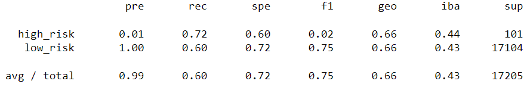
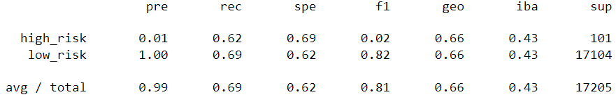
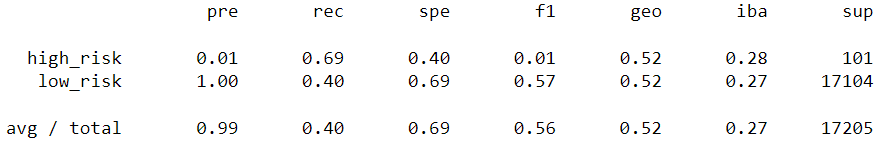
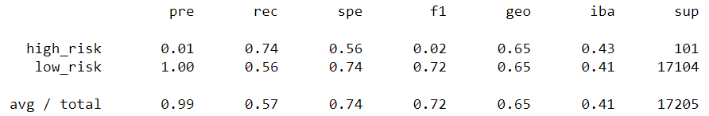
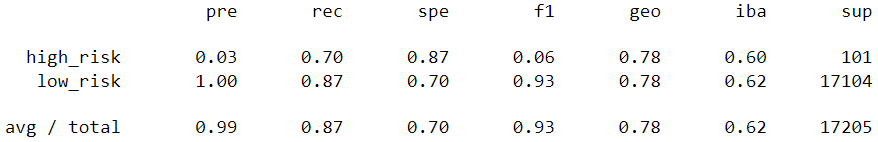
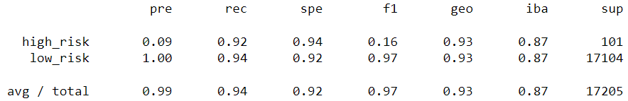

# credit_risk_analysis

## Overview
The purpose of this analysis is to use supervised machine learning to predict the riskiness of loans based on a variety of input features. Because the dataset is severely imbalanced, a variety of oversampling, undersampling, and combination techniques are explored. Ultimately, none is particularly effective at accurately identifying high-risk loans.

## Results

1. Naive Random Oversampling
    * balanced accuracy score: .661
    * classification report
    
2. SMOTE Oversampling
    * balanced accuracy score: .658
    * classification report
    
3. Cluster Centroids Undersampling
    * balanced accuracy score: .545
    * classification report
    
4. SMOTEEN Combination Resampling
    * balanced accuracy score: .653
    * classification report
    
5. Balanced Random Forest
    * balanced accuracy score: .786
    * classification report
    
6. Easy Ensemble AdaBoost
    * balanced accuracy score: .932
    * classification report
    

## Summary
With a balanced accuracy score of 93.2%, Easy Ensemble AdaBoost is by far the best of the models explored in this analysis. However, it is not a *good* model for the data analyzed here, only the best of a bad bunch. Its balanced accuracy score may be over 90%, as is its recall for both high-risk and low-risk loans; however, its precision in identifying high-risk loans is only 9%. If the intent is to use these algorithms to do an initial pass-through of loans to approve, with a more selective secondary test used to distinguish between the truly high-risk and those not cleared as low risk on the first pass, both Balanced Random Forest and Easy Ensemble AdaBoost would do quite well:
|Measure|BRF|EE AB|
|---|---|---|
|Acc Score|.786|.932|
|High Risk Precision|.03|.09|
|Low Risk Precision|1.0|1.0|
|High Risk Recall|.70|.92|
|Low Risk Recall|.87|.94|

However, in terms of precisely identifying high-risk loans that should be declined, none of these algorithms scores above 10%; all of them are abject failures in that regard, and therefore none are recommended as a solo measure of credit risk.
